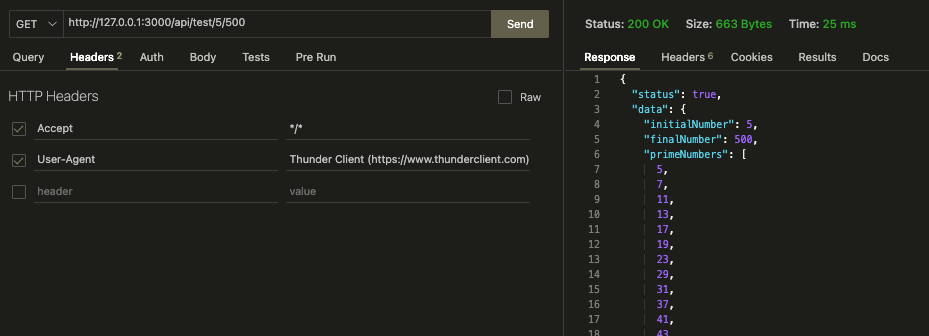

## Prueba técnica de Digital Quo, usando Node y express que resuelve lo siguiente:

Realizar una API que reciba 2 variables: initialNumber y finalNumber (Los números deben ser enteros positivos e initialNumber no puede ser mayor a finalNumber) para los cuales se debe regresar la siguiente información:

- Números primos que se encuentran en el rango entre initialNumber y finalNumber.(tomando en cuenta InitialNumber y finalNumber).
- Cantidad de números que se encuentran entre initialNumber y finalNumber (sin tomar en cuenta estos últimos).
- Suma de todos los números consecutivos que se encuentran dentro de initialNumber y finalNumber (sin tomar en cuenta estos últimos).
- Utilizando initialNumber y finalNumber como puntos iniciales crear una sucesión de Fibonacci que termine en el momento en el que la suma de los primeros 10 términos sea igual al séptimo término multiplicado por 11.
- Regresar la información en JSON, en un data con su respectivo status.

## Instrucciones

- Clonar repositorio
- Instalar las dependencias usando:
    npm install
- Para tener listo el servidor correr el comando:
    npm run dev
- Usando la herramienta de [postman](https://www.postman.com/) o la extensión [thunder client](https://www.thunderclient.com/) en visual code realizar solicitud en localhost o tambien puede usar 127.0.0.1 y el puerto 3000 por defecto, por ejemplo donde initialNumber = 5 y finalNumber = 500 y usando la solicitud en GET:
    http://127.0.0.1:3000/api/test/5/500

